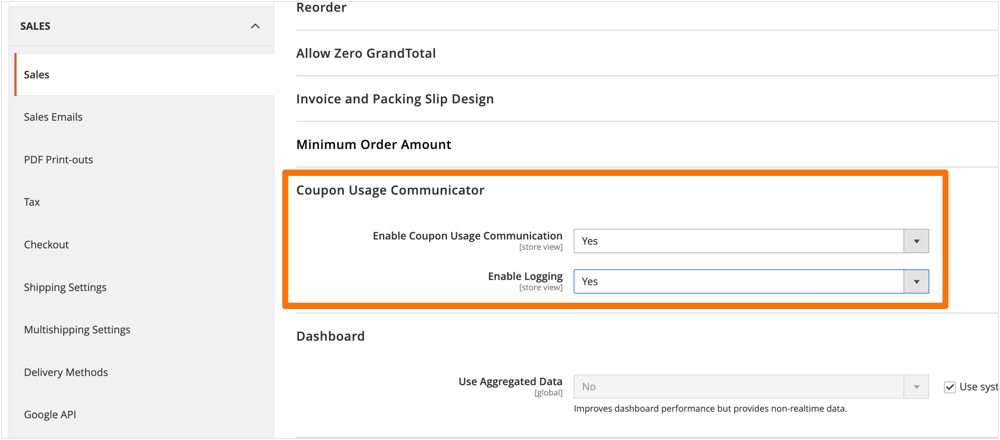
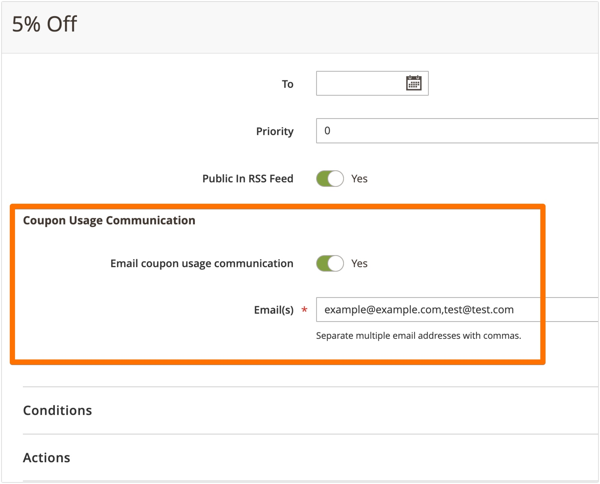
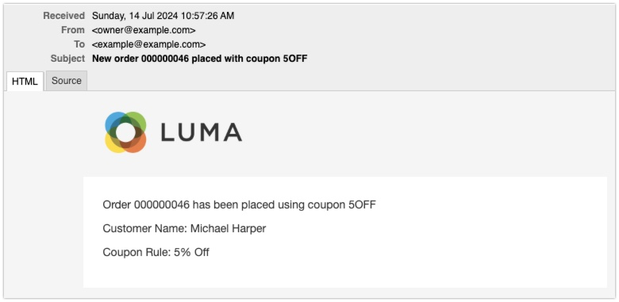

# Coupon Usage Communicator for Magento 2

This extension allows Magento 2 store owners to communicate coupon usage via email. It integrates seamlessly with the Magento 2 sales rule configuration, providing an additional option to send email notifications upon coupon usage.

## Screenshots

### Store Configuration > Sales > Sales > Coupon Usage Communicator


### Cart Rule UI Additions


### Email Alerts


## Requirements

- Magento 2.4.x or later
- PHP 7.3 or later
- Access to the server command line

## Installation

### Via Composer

1. Open your terminal application.
2. Navigate to the root directory of your Magento 2 installation.
3. Add the GitHub repository to your `composer.json`:

```bash
composer config repositories.coupon-usage-communicator vcs https://github.com/michaelharper/Coupon-Usage-Communicator
```
4. Require the extension:

```bash
composer require michaelharper/coupon-usage-communicator:dev-main
```
5. Enable the module:

```bash
php bin/magento module:enable MichaelHarper_CouponUsageCommunicator
```

6. After Composer finishes updating, run the following Magento CLI commands:

```bash
php bin/magento setup:upgrade
php bin/magento setup:di:compile
php bin/magento setup:static-content:deploy -f
php bin/magento cache:flush
```
### Manual Installation
If you prefer manual installation:

1. Download the extension files from the GitHub repository.
2. Create a directory app/code/MichaelHarper/CouponUsageCommunicator in your Magento 2 installation.
3. Extract the downloaded files into this directory.
4. Enable the module:

```bash
php bin/magento module:enable MichaelHarper_CouponUsageCommunicator
```

## Post-Installation Configuration

After installing the Coupon Usage Communicator extension, you need to perform some configuration steps to enable and use its features.

### Enabling the Extension

1. Go to `Stores` > `Configuration` > `Sales` > `Sales` > `Coupon Usage Communicator` in your Magento Admin Panel.
2. Set `Enable Coupon Usage Communication` to `Yes` to activate the extension.

### Configuring Logging (Optional)

- Logging is optional and is primarily recommended for debugging purposes.
- Enable it if you need to troubleshoot or monitor the extension's activities.
- coupon_usage_communicator.log will be created in the Magento log directory

### Configuring Coupon Usage Communication in Cart Rules

1. Navigate to the cart rule where you want to enable coupon usage communication.
2. You will find a new section added by the extension. Toggle `Enable coupon usage communication` to `Yes`.
3. Specify the email addresses that should receive notifications about coupon usage.

By following these steps, you will have successfully configured the Coupon Usage Communicator extension for your Magento 2 store.

## Support

If you find Couon Usage Communicator useful and would like to support its development, consider making a donation:

- **Buy Me a Coffee:** Support on [Buy Me a Coffee](https://buymeacoffee.com/michaelharper)

## License

Coupon Usage Communicator is licensed under the MIT License. See the LICENSE file for more details.
